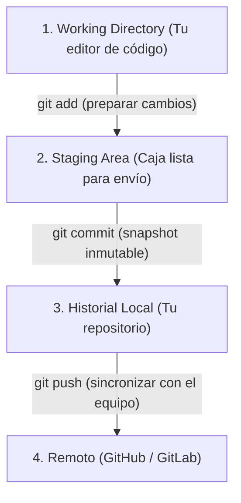

# Guía de Conventional Commits y Buenas Prácticas de Git

Guía práctica para estructurar mensajes de confirmación (*commits*) limpios, profesionales y trazables siguiendo la especificación estándar de **Conventional Commits v1.0.0**.

---

## 1. ¿Por qué usamos Conventional Commits?

Un historial de Git no es un basurero de respaldos; es la **bitácora de ingeniería** del proyecto. 

Beneficios:
- **Trazabilidad:** Cualquier desarrollador entiende qué cambió y por qué sin tener que leer el diff.
- **Generación automática de Changelogs:** Herramientas automatizadas pueden compilar notas de versión (*releases*) automáticamente.
- **Búsqueda eficiente:** Permite usar `git log --grep="^feat"` o `git bisect` para aislar regresiones rápidamente.

---

## 2. Anatomía de un Commit

```text
<tipo>(<alcance_opcional>): <descripción concisa>

[cuerpo_opcional: explica el QUÉ y el POR QUÉ, no el CÓMO]

[pie_de_página_opcional: referencias a issues, breaking changes]
```

### Reglas Básicas de Formato:
1. **Minúsculas:** El tipo y el alcance van siempre en minúsculas (`feat`, `fix`, no `FEAT` ni `Fix`).
2. **Modo Imperativo en Tiempo Presente:** Escribir como si le dieras una orden a Git (*"add navigation"*, no *"added navigation"* ni *"adding navigation"*).
3. **Sin punto final:** La primera línea no lleva punto (`.` al final).
4. **Límite de caracteres:** La primera línea debe tener **72 caracteres o menos**.

---

## 3. Catálogo de Tipos

| Tipo | Cuándo Usarlo | Ejemplo Real en este Proyecto |
| :--- | :--- | :--- |
| **`feat`** | Se añade una nueva funcionalidad para el usuario final. | `feat(layout): add floating dock navigation style` |
| **`fix`** | Se corrige un fallo o error en funcionalidad existente. | `fix(layout): remove redundant dark variant in sidebar dock` |
| **`docs`** | Solo se modifica documentación (archivos `.md`, diagramas, guías). | `docs(theme): add M3 color system architecture guide` |
| **`refactor`** | Cambios en código que no corrigen errores ni añaden funcionalidades (limpieza interna). | `refactor(fab): simplify color class binding with dictionary lookup` |
| **`style`** | Cambios cosméticos de código que no alteran la lógica (espaciado, comas, formateo de Prettier). | `style(core): format layout service methods and imports` |
| **`perf`** | Mejora de rendimiento o consumo de recursos (memoria, CPU, carga). | `perf(auth): optimize bundle splitting for lazy loaded routes` |
| **`test`** | Añadir pruebas faltantes o corregir pruebas existentes (Karma, Jasmine). | `test(auth): add unit test for password validation regex` |
| **`build`** | Cambios que afectan el sistema de construcción o herramientas de bundling (Angular CLI, PostCSS). | `build: configure postcss tailwindcss v4 plugin` |
| **`ci`** | Cambios en archivos de integración o despliegue continuo (GitHub Actions, Docker). | `ci: add workflow to validate linting and unit tests on push` |
| **`chore`** | Tareas rutinarias de mantenimiento que no tocan código de producción (actualización de paquetes en `package.json`). | `chore(deps): update tailwindcss to v4.3.3` |

---

## 4. El Alcance (*Scope*)

El *alcance* (opcional pero muy recomendado) indica **qué módulo o parte del sistema se modificó**.

Ejemplos de alcances en este proyecto:
- `(layout)`: Para barras, sidebars, docks o cabeceras generales.
- `(auth)`: Para módulos de login, registro o guards.
- `(theme)`: Para tokens, paletas o modo oscuro en `styles.css`.
- `(ui)`: Para componentes atómicos reutilizables (`m3-button`, `m3-fab`, `m3-dialog`).
- `(pomodoro)`: Para la lógica o vista del temporizador de enfoque.

```text
feat(pomodoro): implement audio chime on interval completion
fix(auth): redirect to login on token expiration
refactor(ui): extract icon button component to shared module
```

---

## 5. Cambios con Ruptura (*Breaking Changes*)

Si un cambio rompe compatibilidad hacia atrás (por ejemplo, renombrar un input obligatorio de un componente compartido o cambiar una API):

1. Se añade un signo de exclamación `!` después del tipo/alcance.
2. Opcionalmente, se describe en el pie del commit con `BREAKING CHANGE:`.

```text
refactor(ui)!: rename [color] input to [variant] in m3-button

BREAKING CHANGE: The `color` input has been deprecated in favor of `variant` to align with M3 specifications.
```

---

## 6. La Regla de Oro: Commits Atómicos

Un commit debe resolver **una única cosa bien hecha**. Evitá acumular 10 cambios distintos bajo un solo commit genérico como *"avances del día"* o *"correcciones varias"*.

### ¿Por qué?
Si commiteás 20 archivos juntos y uno introduce un bug sutil, revertir ese commit te obligará a perder o desarmar los otros 19 archivos que sí funcionaban. Con commits atómicos, revertir un cambio toma exactamente un comando: `git revert <hash>`.

### Cómo preparar commits atómicos:

1. **Revisá el estado:**
   ```bash
   git status
   ```

2. **Agregá solo los archivos relacionados con la intención actual:**
   ```bash
   git add docs/M3_COLOR_SYSTEM.md
   git commit -m "docs(theme): add M3 color system guide"
   ```

3. **Agregá el siguiente grupo con su respectivo prefijo:**
   ```bash
   git add src/app/layout/components/layout-sidebar/
   git commit -m "fix(layout): remove conflicting dark variant in dock"
   ```

4. **Sube tus cambios cuando la unidad de trabajo esté lista:**
   ```bash
   git push
   ```

---

## 7. El Modelo Mental de Git: Las 3 Zonas y Gestión de Errores

Para no cometer errores ni temerle a Git, es fundamental entender dónde vive el código en cada etapa:



### 7.1. Los 5 Escenarios Reales: El Cuándo y el Porqué

#### Escenario 1: Inspeccionar el estado antes de actuar (`git status` y `git diff`)
- **El porqué:** Nunca se debe agregar código a ciegas.
- `git status`: Informa qué archivos tienen cambios en el editor (en rojo) y cuáles ya están preparados en Staging (en verde).
- `git diff`: Muestra línea por línea qué agregaste o quitaste antes de confirmarlo.

#### Escenario 2: Descartar cambios locales en el editor (`git restore`)
- **Momento:** Modificaste archivos en el editor, pero **todavía no hiciste commit**.
- **Comando:** `git restore <ruta/al/archivo>`
- **El porqué:** Devuelve el archivo al estado exacto del último commit, descartando el código nuevo no deseado.

#### Escenario 3: Sacar archivos agregados por error en Staging (`git restore --staged`)
- **Momento:** Ejecutaste `git add .` por accidente y preparaste archivos que no pertenecen a este commit.
- **Comando:** `git restore --staged <ruta/al/archivo>`
- **El porqué:** Saca el archivo de la caja de despacho (Staging), pero **no borra tu código del editor**. Vuelve a quedar listo para revisarse.

#### Escenario 4: Corregir un commit local ANTES del push (`git commit --amend` / `git reset --soft`)
- **Momento:** Ya ejecutaste `git commit`, pero **todavía NO hiciste `git push`** y querés cambiar el mensaje o agregar un archivo que olvidaste.
- **Opción A (Corregir mensaje o agregar archivos olvidados):**
  ```bash
  git add archivo-olvidado.ts
  git commit --amend -m "tipo(scope): nuevo mensaje corregido"
  ```
- **Opción B (Desarmar el commit por completo):**
  ```bash
  git reset --soft HEAD~1
  ```
- **El porqué:** Deshace el último commit pero **conserva todos tus cambios intactos** en el editor y listos en Staging.

#### Escenario 5: Deshacer un commit que YA se subió a GitHub (`git revert`)
- **Momento:** Ya hiciste `git push` a `origin/main` y se detectó que ese commit introdujo un error en producción.
- **Comando:**
  ```bash
  git revert <hash-del-commit>
  ```
- **Por qué NUNCA usar `reset` en ramas remotas:** Si borrás un commit que tus compañeros ya descargaron, destruís la historia compartida del equipo. `git revert` es la solución segura y profesional: crea un nuevo commit que aplica la inversa exacta del cambio defectuoso sin alterar la línea de tiempo.

---

## 8. Hoja de Referencia Rápida (Cheat Sheet)

```bash
# Feature nueva
git commit -m "feat(scope): add new capability"

# Corrección de bug
git commit -m "fix(scope): resolve unexpected behavior"

# Documentación
git commit -m "docs(scope): document architectural pattern"

# Refactorización interna
git commit -m "refactor(scope): streamline component logic"

# Dependencias / Mantenimiento
git commit -m "chore(scope): bump dependency version"

# Deshacer último commit local manteniendo el código
git reset --soft HEAD~1

# Revertir commit público en remoto de forma segura
git revert <hash>
```
