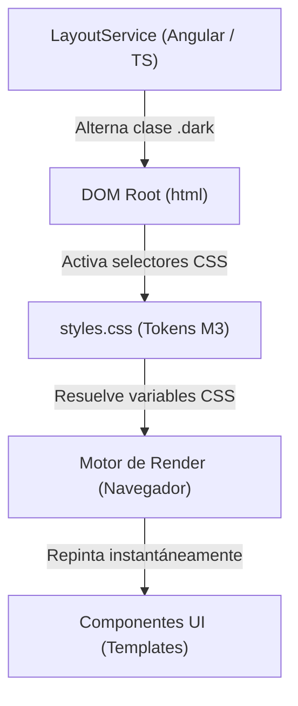

# Sistema de Color Material Design 3 (M3) y Arquitectura de Temas

Guía técnica y metodológica sobre la arquitectura de color, el uso de **Design Tokens**, la conmutación automática de temas (*Light/Dark mode*) y el flujo de trabajo en **Angular 19** con **Tailwind CSS v4**.

---

## 1. Filosofía de Diseño: Conceptos > Código

El enfoque tradicional de estilado web suele asociar estilos directamente a valores visuales arbitrarios (por ejemplo, `bg-white`, `text-gray-900`, `dark:bg-zinc-900`). Este modelo presenta serios problemas de escalabilidad:
- Obliga a duplicar clases en cada elemento del DOM con condicionales (`dark:`).
- Genera inconsistencias visuales y fatiga de decisión al maquetar.
- Dificulta cambios globales de identidad de marca o paletas de colores.

La arquitectura de **Material Design 3 (M3)** desacopla la **intención semántica** de la **presentación visual**. El código del componente solo declara *qué rol cumple el elemento* (una superficie, una acción principal, un texto secundario); el sistema de tokens CSS se encarga de resolver *qué color físico representa* según el contexto activo.

---

## 2. Los Tres Actores de la Arquitectura

El cambio de tema no depende de una lógica compleja distribuida en cada componente. Se basa en una estricta separación de responsabilidades entre tres capas:



### 2.1. El Director de Estado: `LayoutService` (TypeScript)
Ubicado en `src/app/core/services/layout.service.ts`.
- **Única responsabilidad:** Gestionar el estado reactivo (`isDarkMode = signal<boolean>(...)`) y manipular la clase CSS en el elemento raíz del documento (`document.documentElement.classList.toggle('dark')`).
- Utiliza la API nativa de **View Transitions** (`document.startViewTransition(...)`) para garantizar transiciones suaves entre temas a 60/120 Hz.
- **Lo que NO hace:** No calcula colores, no inyecta estilos en línea y no conoce los componentes que existen en la interfaz.

### 2.2. El Contrato de Tokens: `styles.css` (Tailwind CSS v4)
Ubicado en `src/styles.css`.
- **Única responsabilidad:** Servir como la fuente única de verdad para el sistema de diseño.
- Declara las variables CSS bajo la directiva `@theme` para exponer clases de utilidad en Tailwind (`bg-md-sys-surface`, `text-md-sys-primary`).
- Sobreescribe los valores de las mismas variables dentro del selector `:root.dark, .dark`.

### 2.3. El Ejecutor: El Motor de Render del Navegador (Runtime)
- Al conmutar la clase `.dark` en la etiqueta raíz `<html>`, el motor del navegador resuelve la cascada de variables CSS y ejecuta un repintado (*repaint*) acelerado por GPU.
- **Rendimiento:** Angular no re-renderiza componentes; el cambio de color ocurre enteramente en la capa nativa del navegador.

---

## 3. Arquitectura de Color de Material Design 3

### 3.1. El Algoritmo de Semilla (Seed Color) y el Espacio HCT
Google diseñó M3 utilizando el espacio de color **HCT** (*Hue, Chroma, Tone*). A partir de un único color inicial denominado **Semilla (Seed Color)** (por ejemplo, `#EF4444` para Rojo):

1. **Extrae el matiz (*Hue*)** del color seleccionado.
2. **Genera 5 familias tonales paramétricas**:
   - **Primary:** El matiz original con saturación protagonista para acciones principales.
   - **Secondary:** El mismo matiz con menor saturación para elementos de apoyo (chips, filtros).
   - **Tertiary:** Un matiz complementario o armónico adyacente para acentos de balance.
   - **Neutral:** Escala de grises sutilmente tintados con el matiz semilla (evita grises fríos genéricos). De aquí nacen los fondos y superficies (`surface`, `surface-container-*`).
   - **Neutral Variant:** Grises con mayor croma para bordes, divisores y textos secundarios (`outline`, `on-surface-variant`).

Cada familia tonal genera una escala matemática de 0 (negro absoluto) a 100 (blanco absoluto).

---

### 3.2. Catálogo de Roles Semánticos

| Rol M3 | Clase Tailwind | Uso Recomendado |
| :--- | :--- | :--- |
| **Surface** | `bg-md-sys-surface` | Fondo base de la pantalla o viewport. |
| **Surface Container Lowest** | `bg-md-sys-surface-container-lowest` | Tarjetas planas o fondos de menor jerarquía. |
| **Surface Container Low** | `bg-md-sys-surface-container-low` | Contenedores sutiles sobre el fondo base. |
| **Surface Container** | `bg-md-sys-surface-container` | Contenedores estándar (tarjetas por defecto). |
| **Surface Container High** | `bg-md-sys-surface-container-high` | Barras de navegación, diálogos o modales. |
| **Surface Container Highest**| `bg-md-sys-surface-container-highest` | Elementos de máxima elevación o flotantes (Docks, FABs). |
| **Primary** | `bg-md-sys-primary` | Botón o acción principal de la pantalla. |
| **Primary Container** | `bg-md-sys-primary-container` | Estados activos de navegación, selecciones destacadas. |
| **Secondary** | `bg-md-sys-secondary` | Botones secundarios, badges de estado estándar. |
| **Secondary Container** | `bg-md-sys-secondary-container` | Chips interactivos, tags, elementos seleccionables. |
| **Tertiary** | `bg-md-sys-tertiary` | Acentos complementarios (ej. cronómetros, badges especiales). |
| **Error** | `bg-md-sys-error` | Alertas críticas, botones de borrado o acciones destructivas. |
| **Outline** | `border-md-sys-outline` | Bordes con alto contraste (inputs, separadores clave). |
| **Outline Variant** | `border-md-sys-outline-variant` | Bordes sutiles y divisores internos de tarjetas. |

---

### 3.3. La Regla de Oro: El Prefijo `on-*` (Accesibilidad Garantizada)

En M3, el color de un texto o icono **nunca se elige de forma arbitraria**. Siempre se define en relación directa con el contenedor sobre el que se encuentra mediante el prefijo `on-`:

```html
<!-- CORRECTO: Cada superficie usa su contraparte semántica -->
<div class="bg-md-sys-primary text-md-sys-on-primary">...</div>
<div class="bg-md-sys-surface text-md-sys-on-surface">...</div>
<div class="bg-md-sys-primary-container text-md-sys-on-primary-container">...</div>

<!-- Para textos secundarios o de menor jerarquía sobre la superficie -->
<span class="text-md-sys-on-surface-variant">Texto secundario</span>
```

Esta convención garantiza matemáticamente los ratios de contraste recomendados por las pautas WCAG (mínimo 4.5:1 para texto estándar).

---

## 4. Conmutación Automática en `styles.css`

### 4.1. Estructura de Declaración de Tokens
En Tailwind CSS v4, los tokens claros y oscuros se declaran de la siguiente manera:

```css
/* ==========================================================================
   1. MODO CLARO (Valores por defecto en el tema)
   ========================================================================== */
@theme {
  --color-md-sys-surface: #FAFAFA;
  --color-md-sys-surface-container: #F2F1EE;
  --color-md-sys-on-surface: #1C1917;
  --color-md-sys-primary: #18181B;
  --color-md-sys-on-primary: #FFFFFF;
}

/* ==========================================================================
   2. MODO OSCURO (Sobreescritura de variables cuando existe la clase .dark)
   ========================================================================== */
:root.dark,
.dark {
  color-scheme: dark;

  --color-md-sys-surface: #0C0A09;
  --color-md-sys-surface-container: #1C1917;
  --color-md-sys-on-surface: #FAF9F5;
  --color-md-sys-primary: #FAF9F5;
  --color-md-sys-on-primary: #18181B;
}
```

### 4.2. Por qué no se debe usar `dark:` en los Templates HTML

Cuando se utiliza una clase como `bg-md-sys-surface`, Tailwind compila a:
```css
.bg-md-sys-surface {
  background-color: var(--color-md-sys-surface);
}
```

Debido a que `--color-md-sys-surface` cambia automáticamente de valor en el navegador según la presencia de `.dark`:
- Escribir `class="bg-md-sys-surface dark:bg-md-sys-surface"` es redundante.
- Mezclar tokens arbitrariamente como `class="bg-md-sys-surface dark:bg-md-sys-surface-container-high"` genera advertencias (*warnings*) en el linter de Tailwind (`applies the same CSS properties as...`), ya que el analizador estático detecta dos clases modificando la misma propiedad (`background-color`).

#### ¿Cuándo sí se utiliza `dark:`?
Únicamente para **excepciones estructurales** que no existen en el modo claro. Por ejemplo, un borde translúcido necesario únicamente en fondos oscuros para delimitar siluetas:
```html
<div class="border-transparent dark:border-md-sys-outline/10">...</div>
```

---

## 5. Flujos de Trabajo (Workflow)

Existen dos estrategias para implementar este sistema:

### Estrategia A: Estática (Material Theme Builder)
1. Abrir la herramienta oficial de Google: [Material Theme Builder](https://material-foundation.github.io/material-theme-builder/).
2. Ingresar el color de marca o semilla deseado.
3. Descargar los archivos exportados (`light.css` y `dark.css`).
4. Copiar las variables de `light.css` dentro de `@theme` en `src/styles.css`.
5. Copiar las variables de `dark.css` dentro de `:root.dark, .dark` en `src/styles.css`.
6. En los templates HTML, utilizar únicamente los nombres semánticos de las utilidades.

### Estrategia B: Dinámica en Tiempo de Ejecución (`@material/material-color-utilities`)
Si la aplicación permite al usuario elegir dinámicamente un color personalizado en tiempo real:
1. Instalar la librería oficial:
   ```bash
   npm install @material/material-color-utilities
   ```
2. En `LayoutService`, derivar la paleta a partir del color seleccionado:
   ```typescript
   import { themeFromSourceColor, argbFromHex, hexFromArgb } from '@material/material-color-utilities';

   applyDynamicColor(hexColor: string) {
     const theme = themeFromSourceColor(argbFromHex(hexColor));
     const scheme = this.isDarkMode() ? theme.schemes.dark : theme.schemes.light;

     // Actualizar las variables en el documento
     const root = document.documentElement;
     root.style.setProperty('--color-md-sys-primary', hexFromArgb(scheme.primary));
     root.style.setProperty('--color-md-sys-surface', hexFromArgb(scheme.surface));
     // ... iterar sobre los tokens clave
   }
   ```

---

## 6. Modelo Mental del Desarrollador (Cómo Pensar una Vista)

Al maquetar un nuevo componente, seguir esta secuencia mental:

1. **¿Qué nivel de elevación o plano ocupa este contenedor?**
   - Lienzo general $\rightarrow$ `bg-md-sys-surface`.
   - Tarjeta o panel de contenido $\rightarrow$ `bg-md-sys-surface-container`.
   - Diálogo modal o menú flotante $\rightarrow$ `bg-md-sys-surface-container-high`.

2. **¿Qué contraste requiere el texto/icono sobre este fondo?**
   - Fondo `surface` $\rightarrow$ Texto `text-md-sys-on-surface`.
   - Texto secundario/metadatos $\rightarrow$ `text-md-sys-on-surface-variant`.

3. **¿Cuál es la acción principal de la pantalla?**
   - Botón de confirmación $\rightarrow$ `bg-md-sys-primary text-md-sys-on-primary`.
   - Botón de cancelación/secundario $\rightarrow$ `bg-md-sys-secondary-container text-md-sys-on-secondary-container`.

4. **¿Necesito escribir la clase `dark:`?**
   - Si se trata de un color de superficie o texto definido en el sistema de diseño: **NO**.
   - El CSS y el navegador resolverán el modo oscuro automáticamente.
